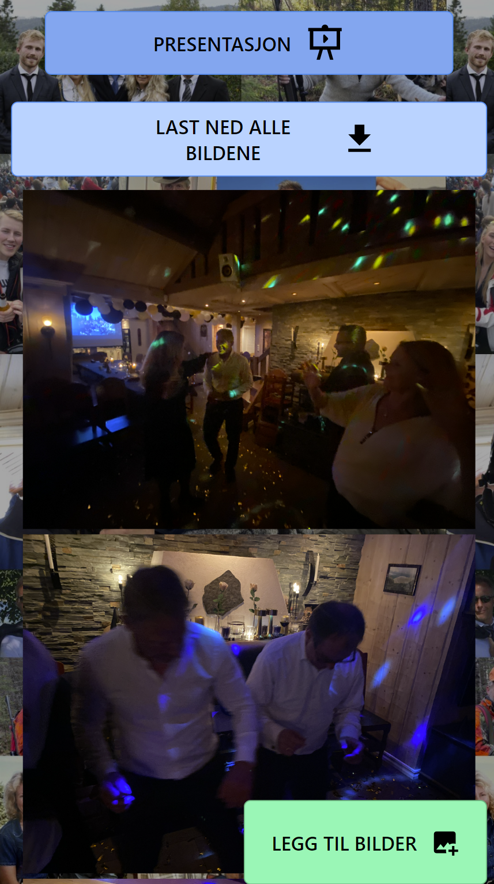
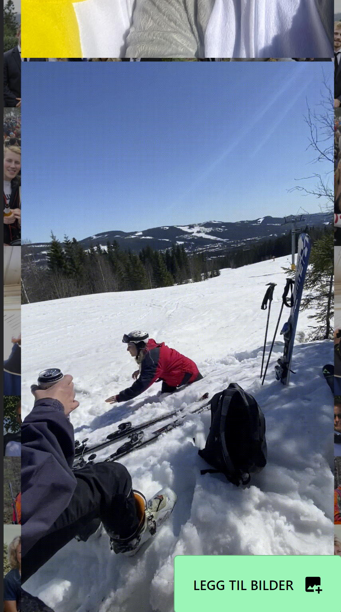

## Bildedelingstjeneste med supabase i Sveltekit

Laget for pappa sin 60 års dag! og ble gjort på noen dager og er derfor ikke feilfri!

Gjestene lastet opp flere bilder fra hytteturen på en bruker opprettet av meg og disse ble deretter vist på lerret på kvelden.
Man kunne deretter laste ned alle bildene som ble tatt i løpet av helgen.
Denne ble aktivt brukt og det ble ganske vellykket!

**PS: Bryter noen standarder for sikkerhet, men passord blir lagret sikkert med supabase.
Skjermer:

